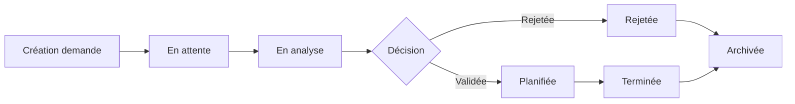

# CAHIER DES CHARGES — AUDAX

**Plateforme de gestion stratégique des audiences**  
**Cabinet du Chef d'État-Major Général — FARDC**

| Élément | Détail |
|--------|--------|
| **Version** | 1.0 |
| **Date** | 22 mai 2026 |
| **Statut** | Document de référence |
| **Classification** | Usage interne — Environnement militair |

---

## 1. Contexte et justification

### 1.1 Contexte institutionnel

Le Cabinet du Chef d'État-Major Général de la FARDC gère quotidiennement un volume croissant de demandes d'audience, de validations hiérarchiques, de planifications et de suivi administratif. Les processus actuels (papier, outils dispersés, communication non centralisée) entraînent des retards, une traçabilité insuffisante et une visibilité limitée pour la prise de décision stratégique.

### 1.2 Problématique

- Absence de plateforme centralisée pour le cycle de vie des audiences
- Validation multi-niveaux peu traçable
- Planification manuelle sujette aux conflits
- Faible visibilité exécutive sur les indicateurs clés
- Risques sécuritaires liés à la gestion des visiteurs et des données sensibles

### 1.3 Solution proposée

**AUDAX** est une application web gouvernementale premium destinée à centraliser, sécuriser et optimiser l'ensemble du processus de gestion des audiences, de la demande initiale jusqu'au reporting exécutif, avec un mode **Command Center** dédié à la supervision stratégique en temps réel.

---

## 2. Objectifs du projet

### 2.1 Objectifs stratégiques

| Objectif | Description |
|----------|-------------|
| **Centralisation** | Point unique pour demandes, validations, planification et suivi |
| **Traçabilité** | Historique complet des décisions et actions administratives |
| **Sécurité** | Conformité aux exigences d'un environnement militaire/gouvernemental |
| **Efficacité opérationnelle** | Réduction des délais de traitement et des conflits d'agenda |
| **Visibilité exécutive** | Tableaux de bord et analytics pour la prise de décision |

### 2.2 Objectifs opérationnels

- Gérer le cycle complet d'une audience (création → validation → planification → clôture)
- Automatiser les notifications et la génération documentaire
- Superviser l'activité en temps réel via le mode Command Center
- Produire des rapports exécutifs exportables (PDF, Excel)
- Garantir une expérience utilisateur fluide, intuitive et premium

### 2.3 Critères de succès

- Réduction mesurable du délai moyen de traitement des demandes
- 100 % des actions sensibles tracées dans le journal d'audit
- Adoption par l'ensemble des rôles cibles sans formation lourde
- Zéro incident de sécurité majeur en phase pilote
- Interface perçue comme « centre de commandement numérique moderne »

---

## 3. Périmètre du projet

### 3.1 Inclus (MVP + extensions)

| Module | Périmètre |
|--------|-----------|
| Authentification & RBAC | Login, JWT, 2FA, gestion des rôles |
| Dashboard exécutif | Vue synthétique, KPI, activités récentes |
| Gestion des audiences | CRUD, statuts, priorités, pièces jointes |
| Workflow de validation | Multi-niveaux, commentaires, historique |
| Gestion des visiteurs | Profils, badges, historique |
| Agenda intelligent | Calendrier interactif, conflits, vues multiples |
| Gestion documentaire | PDF, convocations, accusés de réception |
| Notifications | Email, SMS, in-app, alertes prioritaires |
| Reporting & Analytics | Graphiques, exports, indicateurs stratégiques |
| Journal d'audit | Logs complets, traçabilité |
| Command Center | Mode supervision temps réel premium |
| Administration | Utilisateurs, paramètres système |

### 3.2 Exclus (hors périmètre v1)

- Intégration avec des systèmes tiers non spécifiés (ERP, RH externe)
- Application mobile native (responsive web uniquement en v1)
- Reconnaissance biométrique / contrôle d'accès physique aux locaux
- Module de visioconférence intégré
- Multilingue au-delà du français (préparation i18n possible)

### 3.3 Hypothèses

- Infrastructure VPS Linux disponible pour le déploiement
- PostgreSQL hébergé et administré
- Service SMS et email opérationnels (SMTP, API SMS)
- Identité visuelle institutionnelle validée par le commanditaire
- Processus métier de validation hiérarchique documenté

---

## 4. Utilisateurs cibles et rôles

### 4.1 Profils utilisateurs

| Rôle | Description | Accès principal |
|------|-------------|-----------------|
| **Administrateur système** | Configuration, utilisateurs, audit | Accès total |
| **Chef de cabinet** | Validation finale, supervision, reporting | Dashboard, Command Center, rapports |
| **Secrétaire** | Saisie, planification, documents | Audiences, agenda, visiteurs |
| **Officier de validation** | Analyse et validation intermédiaire | Workflow, audiences en attente |
| **Agent d'accueil** | Accueil visiteurs, badges | Visiteurs, audiences du jour |
| **Observateur** | Consultation seule (lecture) | Dashboard, listes, rapports (lecture) |

### 4.2 Matrice RBAC (extrait)

| Fonctionnalité | Admin | Chef | Secrétaire | Officier | Accueil | Observateur |
|----------------|:-----:|:----:|:----------:|:--------:|:-------:|:-----------:|
| Créer audience | ✓ | ✓ | ✓ | — | — | — |
| Valider audience | ✓ | ✓ | — | ✓ | — | — |
| Planifier agenda | ✓ | ✓ | ✓ | — | — | — |
| Gérer visiteurs | ✓ | ✓ | ✓ | — | ✓ | — |
| Command Center | ✓ | ✓ | — | — | — | — |
| Rapports exécutifs | ✓ | ✓ | ✓ | ✓ | — | ✓ (lecture) |
| Audit système | ✓ | — | — | — | — | — |
| Gestion utilisateurs | ✓ | — | — | — | — | — |

---

## 5. Exigences fonctionnelles détaillées

### 5.1 Module — Authentification sécurisée (AUTH)

| ID | Exigence | Priorité |
|----|----------|----------|
| AUTH-01 | Login par identifiant/mot de passe avec validation côté serveur | P0 |
| AUTH-02 | Émission JWT (access token) + refresh token avec rotation | P0 |
| AUTH-03 | Expiration de session configurable par rôle | P0 |
| AUTH-04 | Double authentification (2FA) — TOTP ou SMS | P0 |
| AUTH-05 | Verrouillage de compte après N tentatives échouées (configurable) | P0 |
| AUTH-06 | Gestion des rôles et permissions granulaires (RBAC) | P0 |
| AUTH-07 | Déconnexion forcée / révocation de session | P1 |
| AUTH-08 | Réinitialisation sécurisée du mot de passe | P1 |
| AUTH-09 | Journalisation de chaque tentative de connexion | P0 |

### 5.2 Module — Dashboard exécutif (DASH)

| ID | Exigence | Priorité |
|----|----------|----------|
| DASH-01 | Vue synthétique des audiences du jour | P0 |
| DASH-02 | Statistiques dynamiques (en attente, validées, rejetées, planifiées) | P0 |
| DASH-03 | Calendrier rapide (mini-agenda) | P0 |
| DASH-04 | Flux de notifications live | P0 |
| DASH-05 | Timeline des activités récentes | P0 |
| DASH-06 | Liste des demandes urgentes / prioritaires | P0 |
| DASH-07 | Indicateurs critiques (KPI configurables) | P1 |
| DASH-08 | Graphiques analytiques (tendances, répartition) | P1 |
| DASH-09 | Animations légères (Framer Motion) sans dégradation des perfs | P1 |

### 5.3 Module — Gestion des audiences (AUD)

| ID | Exigence | Priorité |
|----|----------|----------|
| AUD-01 | Création de demande d'audience avec formulaire structuré | P0 |
| AUD-02 | Champs : objet, motif, demandeur, visiteur(s), priorité, confidentialité | P0 |
| AUD-03 | Statuts : En attente → En analyse → Validée/Rejetée → Planifiée → Terminée | P0 |
| AUD-04 | Modification et annulation avec traçabilité | P0 |
| AUD-05 | Suivi du statut en temps réel | P0 |
| AUD-06 | Niveaux de priorité (normale, urgente, critique) | P0 |
| AUD-07 | Niveaux de confidentialité (standard, restreint, secret) | P0 |
| AUD-08 | Pièces jointes sécurisées (types et tailles limités) | P0 |
| AUD-09 | Catégorisation des audiences (diplomatique, militaire, civil, etc.) | P1 |
| AUD-10 | Recherche, filtres et tri avancés | P0 |
| AUD-11 | Vue liste et vue détail | P0 |

### 5.4 Module — Workflow de validation (WF)

| ID | Exigence | Priorité |
|----|----------|----------|
| WF-01 | Validation multi-niveaux configurable | P0 |
| WF-02 | Historique complet des décisions (qui, quand, quoi) | P0 |
| WF-03 | Commentaires internes (non visibles par le demandeur externe) | P0 |
| WF-04 | Journal des décisions exportable | P1 |
| WF-05 | Notifications automatiques à chaque changement de statut | P0 |
| WF-06 | Escalade automatique en cas de dépassement de délai | P2 |

### 5.5 Module — Gestion des visiteurs (VIS)

| ID | Exigence | Priorité |
|----|----------|----------|
| VIS-01 | Fiche visiteur : nom, photo, organisme, fonction, contacts | P0 |
| VIS-02 | Historique des audiences par visiteur | P0 |
| VIS-03 | Badge numérique générable (QR code) | P1 |
| VIS-04 | Niveau d'accès associé au visiteur | P0 |
| VIS-05 | Détection des doublons | P1 |
| VIS-06 | Import/export CSV sécurisé | P2 |

### 5.6 Module — Agenda intelligent (AGD)

| ID | Exigence | Priorité |
|----|----------|----------|
| AGD-01 | Calendrier interactif (jour / semaine / mois) | P0 |
| AGD-02 | Drag & drop pour replanification | P0 |
| AGD-03 | Détection et alerte de conflits horaires | P0 |
| AGD-04 | Gestion des disponibilités du cabinet | P1 |
| AGD-05 | Affichage des salles et de leur état | P1 |
| AGD-06 | Export iCal (optionnel v1) | P2 |

### 5.7 Module — Gestion documentaire (DOC)

| ID | Exigence | Priorité |
|----|----------|----------|
| DOC-01 | Génération PDF de convocation | P0 |
| DOC-02 | Accusé de réception automatique | P0 |
| DOC-03 | Notes administratives templatisées | P1 |
| DOC-04 | Export sécurisé avec filigrane / métadonnées | P1 |
| DOC-05 | Archivage des documents générés | P0 |

### 5.8 Module — Notifications (NOT)

| ID | Exigence | Priorité |
|----|----------|----------|
| NOT-01 | Notifications in-app en temps réel | P0 |
| NOT-02 | Envoi email (SMTP sécurisé) | P0 |
| NOT-03 | Envoi SMS (API tierce) | P1 |
| NOT-04 | Alertes prioritaires (urgent, critique) | P0 |
| NOT-05 | Préférences de notification par utilisateur | P1 |
| NOT-06 | Centre de notifications (historique, marquage lu/non lu) | P0 |

### 5.9 Module — Reporting & Analytics (RPT)

| ID | Exigence | Priorité |
|----|----------|----------|
| RPT-01 | Statistiques exécutives (tableaux de bord analytiques) | P0 |
| RPT-02 | Graphiques modernes (barres, courbes, camemberts) | P0 |
| RPT-03 | Export Excel et PDF | P0 |
| RPT-04 | Taux de validation / rejet | P0 |
| RPT-05 | Analyses mensuelles et comparatives | P1 |
| RPT-06 | Indicateurs stratégiques configurables | P1 |

### 5.10 Module — Journal d'audit (AUDIT)

| ID | Exigence | Priorité |
|----|----------|----------|
| AUDIT-01 | Log de toutes les actions CRUD sensibles | P0 |
| AUDIT-02 | Horodatage, auteur, IP, action, entité, avant/après | P0 |
| AUDIT-03 | Recherche et filtres avancés | P0 |
| AUDIT-04 | Export des logs pour conformité | P1 |
| AUDIT-05 | Rétention configurable des logs | P1 |
| AUDIT-06 | Alertes sur actions suspectes | P2 |

### 5.11 Module — Command Center (CMD)

| ID | Exigence | Priorité |
|----|----------|----------|
| CMD-01 | Mode plein écran dédié à la supervision | P0 |
| CMD-02 | Affichage temps réel des activités | P0 |
| CMD-03 | Indicateurs critiques en surbrillance (glow discret) | P0 |
| CMD-04 | Audiences prioritaires en vedette | P0 |
| CMD-05 | Monitoring des validations en cours | P0 |
| CMD-06 | Événements récents (feed live) | P0 |
| CMD-07 | État des salles (occupée, libre, réservée) | P1 |
| CMD-08 | Agenda dynamique intégré | P0 |
| CMD-09 | Animations fluides, transitions premium | P1 |
| CMD-10 | Accessible uniquement aux rôles autorisés (Chef, Admin) | P0 |

---

## 6. Exigences non fonctionnelles

### 6.1 Sécurité

| Exigence | Détail |
|----------|--------|
| **Authentification** | JWT + refresh token, 2FA obligatoire pour rôles sensibles |
| **Autorisation** | RBAC granulaire, principe du moindre privilège |
| **Chiffrement** | TLS en transit ; chiffrement au repos pour données sensibles (AES-256) |
| **Protection** | Rate limiting, CSRF, XSS, injection SQL (ORM paramétré) |
| **Sessions** | Expiration, révocation, détection de sessions concurrentes |
| **Audit** | Journal complet, immuable, horodaté |
| **Conformité** | Alignement sur bonnes pratiques OWASP Top 10 |

### 6.2 Performance

| Métrique | Cible |
|----------|-------|
| Temps de chargement initial (LCP) | < 2,5 s |
| Temps de réponse API (p95) | < 300 ms |
| Disponibilité | 99,5 % (hors maintenance planifiée) |
| Utilisateurs concurrents | ≥ 50 (v1) |
| Rafraîchissement Command Center | ≤ 5 s |

### 6.3 Disponibilité et fiabilité

- Sauvegardes PostgreSQL quotidiennes automatiques
- Restauration testée mensuellement
- Déploiement via Docker avec health checks
- CI/CD GitHub Actions (build, test, deploy)

### 6.4 UX/UI

| Critère | Exigence |
|---------|----------|
| **Responsive** | Desktop (prioritaire), tablette, mobile |
| **Accessibilité** | WCAG 2.1 niveau AA (objectif) |
| **Dark mode** | Obligatoire, thème par défaut |
| **Micro-interactions** | Hover, feedback, transitions fluides |
| **Ergonomie** | Navigation ≤ 3 clics pour actions courantes |
| **Inspirations** | Linear, Raycast, Notion, Vercel Dashboard |

### 6.5 Maintenabilité

- Code TypeScript strict, linting, formatting
- Architecture modulaire (frontend / backend découplés)
- Documentation technique (API, schéma BDD, déploiement)
- Tests unitaires et d'intégration sur modules critiques
- Convention de nommage et structure de dossiers documentée

---

## 7. Identité visuelle et design system

### 7.1 Direction artistique

Esthétique **institutionnelle militaire premium** : sobre, raffinée, immersive, comparable à un centre de commandement numérique moderne.

### 7.2 Palette de couleurs

| Token | Usage |
|-------|-------|
| Vert militaire profond | Couleur primaire, accents institutionnels |
| Noir carbone | Fond principal (dark mode) |
| Gris anthracite | Surfaces, cartes, bordures |
| Blanc cassé | Texte principal, contrastes |
| Or discret | Accents premium, indicateurs critiques |

### 7.3 Composants UI

- Basés sur **shadcn/ui** + **TailwindCSS**
- Icônes **Lucide**
- Animations **Framer Motion** (légères, non intrusives)
- Typographie : sans-serif moderne, hiérarchie claire
- Cartes intelligentes avec glow discret en mode Command Center

### 7.4 Pages à construire

1. Login
2. Dashboard
3. Command Center
4. Liste des audiences
5. Nouvelle audience
6. Calendrier
7. Gestion visiteurs
8. Rapports
9. Paramètres
10. Gestion utilisateurs
11. Audit système
12. Notifications
13. Profil utilisateur

---

## 8. Architecture technique

### 8.1 Stack

| Couche | Technologie |
|--------|-------------|
| **Frontend** | Next.js 15, TypeScript, TailwindCSS, shadcn/ui, Framer Motion, Lucide |
| **Backend** | NestJS, API REST sécurisée |
| **Base de données** | PostgreSQL |
| **Auth** | JWT + Refresh Token, 2FA |
| **Conteneurisation** | Docker |
| **CI/CD** | GitHub Actions |
| **Hébergement** | VPS Linux |

### 8.2 Architecture logique

```
┌─────────────────────────────────────────────────────────┐
│                    CLIENT (Navigateur)                   │
│         Next.js 15 — SSR/SSG — Dark Mode Premium        │
└────────────────────────┬────────────────────────────────┘
                         │ HTTPS / REST
┌────────────────────────▼────────────────────────────────┐
│                   API Gateway (NestJS)                   │
│   Auth │ RBAC │ Audiences │ Workflow │ Agenda │ Reports  │
└────────────────────────┬────────────────────────────────┘
                         │
        ┌────────────────┼────────────────┐
        ▼                ▼                ▼
   PostgreSQL      Redis (cache/       Services
   (données)       sessions)          externes
                                    (SMTP, SMS)
```

### 8.3 Structure de dossiers (indicative)

**Frontend (`/apps/web`)**

```
src/
├── app/              # Routes Next.js App Router
├── components/       # Composants réutilisables (ui/, features/)
├── hooks/            # Hooks optimisés
├── lib/              # Utilitaires, API client
├── stores/           # Gestion d'état (Zustand ou équivalent)
├── types/            # Types TypeScript
└── styles/           # Design tokens, globals
```

**Backend (`/apps/api`)**

```
src/
├── modules/
│   ├── auth/
│   ├── users/
│   ├── audiences/
│   ├── visitors/
│   ├── workflow/
│   ├── calendar/
│   ├── documents/
│   ├── notifications/
│   ├── reports/
│   └── audit/
├── common/           # Guards, decorators, filters
├── config/
└── prisma/           # Schéma et migrations
```

### 8.4 Schéma PostgreSQL (entités principales)

| Entité | Description |
|--------|-------------|
| `users` | Comptes, rôles, 2FA, sessions |
| `roles` / `permissions` | RBAC |
| `audiences` | Demandes d'audience |
| `audience_status_history` | Historique des statuts |
| `visitors` | Profils visiteurs |
| `audience_visitors` | Relation N-N |
| `validations` | Décisions de validation |
| `validation_comments` | Commentaires internes |
| `appointments` | Créneaux planifiés |
| `rooms` | Salles d'audience |
| `documents` | Documents générés |
| `attachments` | Pièces jointes |
| `notifications` | Notifications utilisateur |
| `audit_logs` | Journal d'audit |
| `system_settings` | Paramètres configurables |

---

## 9. Flux métier principaux

### 9.1 Cycle de vie d'une audience



### 9.2 Workflow de validation

1. Secrétaire crée la demande → statut **En attente**
2. Officier de validation analyse → **En analyse**
3. Décision intermédiaire (commentaires internes)
4. Chef de cabinet valide ou rejette → **Validée** / **Rejetée**
5. Si validée : planification agenda → **Planifiée**
6. Après audience : clôture → **Terminée**
7. Génération documents + notifications à chaque étape

---

## 10. Livrables

### 10.1 Phase conception

| Livrable | Description |
|----------|-------------|
| Wireframes | Toutes les pages listées (section 7.4) |
| Maquettes UI | Design system complet, dark mode |
| Schéma BDD | Diagramme ER PostgreSQL |
| Spécifications API | OpenAPI / Swagger |

### 10.2 Phase développement

| Livrable | Description |
|----------|-------------|
| Frontend | Application Next.js complète et responsive |
| Backend | API NestJS sécurisée |
| Authentification | JWT, 2FA, RBAC |
| Modules métier | Audiences, workflow, visiteurs, agenda, docs |
| Command Center | Mode supervision temps réel |
| Analytics | Dashboards et exports |
| Audit | Journal complet |

### 10.3 Phase déploiement

| Livrable | Description |
|----------|-------------|
| Docker Compose | Stack complète (web, api, db) |
| GitHub Actions | Pipeline CI/CD |
| Documentation | Installation, configuration, exploitation |
| Guide utilisateur | Par rôle |

---

## 11. Planning indicatif

| Phase | Durée estimée | Livrables |
|-------|---------------|-----------|
| **Phase 0 — Cadrage** | 2 semaines | CDC validé, wireframes, schéma BDD |
| **Phase 1 — Fondations** | 3 semaines | Auth, RBAC, structure projet, design system |
| **Phase 2 — Cœur métier** | 4 semaines | Audiences, workflow, visiteurs |
| **Phase 3 — Planification** | 3 semaines | Agenda, documents, notifications |
| **Phase 4 — Intelligence** | 3 semaines | Dashboard, analytics, Command Center |
| **Phase 5 — Sécurité & audit** | 2 semaines | Audit, durcissement, tests sécurité |
| **Phase 6 — Déploiement** | 2 semaines | Docker, CI/CD, documentation, recette |
| **Total estimé** | **~19 semaines** | Application production-ready |

---

## 12. Critères d'acceptation globaux

- [ ] Tous les rôles peuvent se connecter avec 2FA
- [ ] Cycle complet audience testable de bout en bout
- [ ] Validation multi-niveaux fonctionnelle avec historique
- [ ] Calendrier avec détection de conflits opérationnel
- [ ] Génération PDF convocation et accusé de réception
- [ ] Notifications email et in-app fonctionnelles
- [ ] Command Center affiche données temps réel
- [ ] Rapports exportables PDF/Excel
- [ ] 100 % des actions sensibles dans le journal d'audit
- [ ] Application responsive, dark mode par défaut
- [ ] Déploiement Docker reproductible
- [ ] Documentation technique complète

---

## 13. Risques et mitigations

| Risque | Impact | Mitigation |
|--------|--------|------------|
| Exigences de sécurité non définies | Élevé | Atelier sécurité en Phase 0 |
| Processus métier non formalisé | Moyen | Validation workflow avec le cabinet |
| Indisponibilité SMS/email | Moyen | Fallback in-app, retry automatique |
| Surcharge visuelle Command Center | Faible | Tests UX itératifs, mode sobre |
| Retard déploiement infra | Moyen | Environnement de staging anticipé |

---

## 14. Glossaire

| Terme | Définition |
|-------|------------|
| **Audience** | Rencontre officielle sollicitée auprès du Chef d'État-Major Général |
| **FARDC** | Forces Armées de la République Démocratique du Congo |
| **RBAC** | Role-Based Access Control — contrôle d'accès par rôles |
| **2FA** | Double authentification |
| **Command Center** | Mode supervision stratégique temps réel |
| **Badge numérique** | Identifiant QR pour l'accueil des visiteurs |
| **KPI** | Key Performance Indicator — indicateur clé de performance |

---

## 15. Validation du document

| Rôle | Nom | Signature | Date |
|------|-----|-----------|------|
| Commanditaire | | | |
| Chef de projet | | | |
| Responsable technique | | | |
| Représentant sécurité | | | |

---

Ce cahier des charges constitue le document de référence pour la conception, le développement et la recette de **AUDAX**. Toute évolution de périmètre fera l'objet d'un avenant formalisé.
